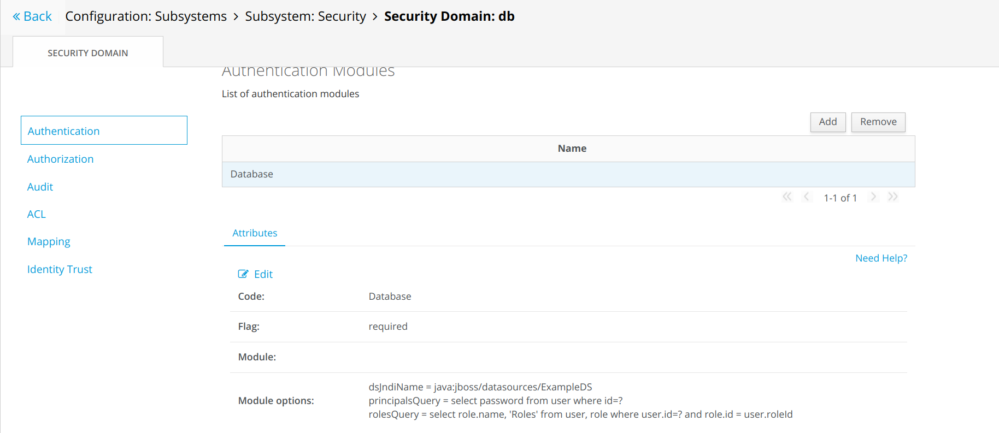

# Team members

- Adham Hazem Fahmy Shafei - 20206011
- Omar Adel Abdel Hamid Ahmed Brikaa - 20206043
- Mootaz Medhat Ezzat AbdelWahab - 20206074
- Ali Esmat Ahmed Orfy - 20206123

# GitHub Repository

https://github.com/Ali-Esmat/SW-Tools-Project

# Setup instructions

From a Linux environment run the `create-sd.sh` script in `enterprise-java-project`:

```bash
cd enterprise-java-project/
./create-sd.sh
```

Alternatively, set the properties in the script manually in the JBoss web console:


# Build instructions

Ensure a JBOSS EAP 7.1 server is running and from `enterprise-java-project` deploy using the maven wildfly plugin.

```bash
cd enterprise-java-project/
mvn clean wildfly:deploy
```

To run the front-end

```bash
cd enterprise-frontend
npm start
```
